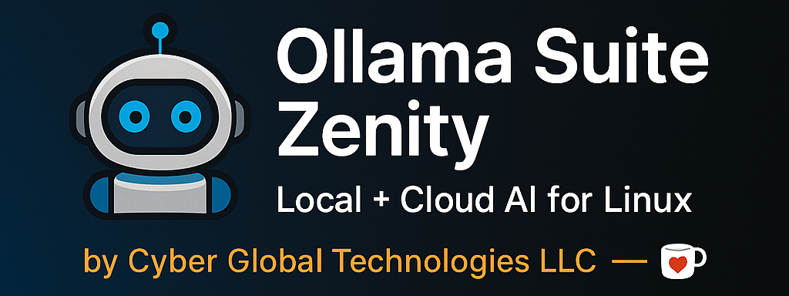

<p align="center">
  
</p>

# 💬 Ollama Chatbox Suite — Zenity & Cloud Edition  
**Part of the Cyber Global Technologies ecosystem**  
Seamlessly chat with local or cloud-based Ollama models using Zenity, Terminal, or your browser.


---

## 🧩 Supported Models

**Local Models**
- `phi3:mini`
- `gemma:2b`

**Cloud Models**
- `deepseek-v3.1:671b-cloud`
- `qwen3-vl:235b-cloud`
- `gpt-oss:20b-cloud`

> 🔐 For cloud models, run:
> ```bash
> ollama signin
> ollama pull <model>
> ```
> before first use.

---

## ⚙️ Features
- Dual-interface launcher (Zenity GUI or Terminal fallback)  
- Browser chat via `ollama-mini.html`  
- Cloud sign-in and pull detection  
- Lightweight local setup — no external dependencies  
- Polished ASCII header and icon branding  

---

## 🚀 Setup

### 1️⃣ Install Ollama
Download or update Ollama from [https://ollama.ai](https://ollama.ai)  
Then start the service:
```bash
ollama serve &
```

### 2️⃣ Launch the Chatbox
Make the main launcher executable:
```bash
chmod +x ollama-chat.sh
./ollama-chat.sh
```

If Zenity is available, you’ll see a graphical model selector with your blue robot icon.  
Otherwise, the suite automatically falls back to a terminal chat prompt.

---

## 💻 Optional Desktop Launcher
To add an icon in your system menu:
```bash
cp ollama-suite.desktop ~/.local/share/applications/
```
Then search **Ollama Chatbox Suite** in your app launcher.

---

## 🌐 Web Mini Chat (optional)
Start the lightweight local server:
```bash
python3 -m http.server 11435
```
Then open your browser at  
👉 [http://localhost:11435/ollama-mini.html](http://localhost:11435/ollama-mini.html)

---

## 🪙 Editions & Access

| Edition | Description | Access | Price |
|----------|--------------|--------|------:|
| **Free Edition** | Local + Cloud chat (Zenity, Terminal, Web) | GitHub / Public | **Free** |
| **Pro Edition** | Enhanced launcher, icon set, one-click setup | [Ko-fi](https://ko-fi.com/s/6b2818394b) | **$29 one-time** |
| **Enterprise Access** | Complimentary with **Compliance AI Enterprise Plan** | [Compliance AI via Stripe](https://compliance.cyberlaboratory.cc) | **Included** |

> 💡 Compliance AI Enterprise subscribers automatically receive the Ollama Chatbox Pro bundle and priority updates.

---

## 📦 Project Structure
```
Ollama-Chatbox-Suite-Zenity-Cloud-Edition/
├── ollama-chat.sh
├── ollama-mini.html
├── ollama-suite.desktop
├── assets/
│   ├── icon.png
│   └── ollama-suite-banner.png
└── LICENSE.md
```

---

## 🧠 Credits
Developed by **Cyber Global Technologies LLC (2025)**  
Focused on secure, human-centered AI and automation tools.

---

<footer style="text-align:center;font-size:13px;color:#7a8b9a;padding:16px 0;border-top:1px solid #1f2a3a;margin-top:30px;">
  <p>© 2025 <strong>Cyber Global Technologies LLC</strong> — Secure, practical, human-focused AI tools.</p>
</footer>
